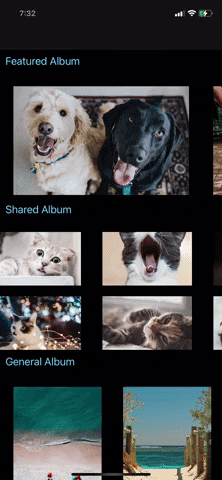

# Compositional CollectionView and Combine

<p align="center">
  
</p>


## Compositional CollectionView and Diffable DataSource
There are three sections, Featured, Shared and General pictures. 
They are rendered by using three seperate layouts one for each.

All the sections scroll horizontally and this is done by setting 
```section.orthogonalScrollingBehavior = .groupPaging```

Snapshots are created when data changes which are applied to collectionView to render the changes.


## Combine

Network layer uses `dataTaskPublisher` to fetch data from network and create objects using `Codables`.


